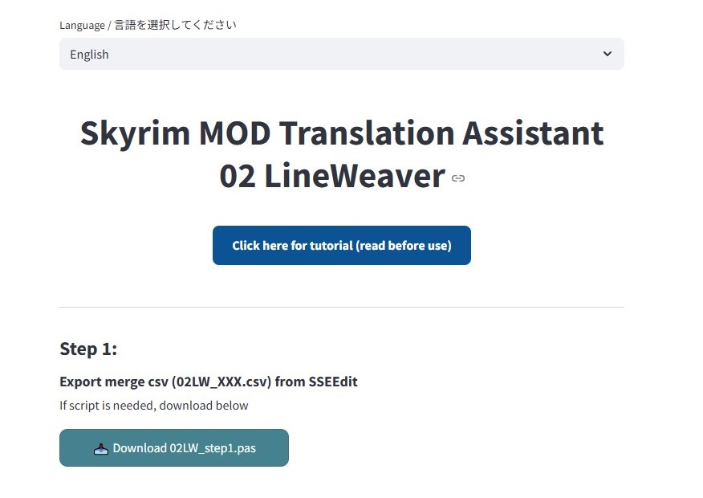

# 02 LineWeaver  💫  
## - スカイリムMOD 文脈重視の翻訳者向け支援ツール  
## - Skyrim MOD Translation Assistant Tool

🚀 Open in Streamlit: https://02lineweaver-ufufhnq7mpz8jcskbbcis7.streamlit.app/

- Skyrim SE/AE MODの翻訳を、自動翻訳だけではなく、物語や会話の流れ・文脈を把握して翻訳したい人のための支援ツールです。  
- xTranslator / SSEEdit と連携し、レコード情報の整理・変換・再構築が可能。<br>
<br>

- A support tool for those who want to translate Skyrim SE/AE MODs not just with machine translation, but while understanding the story flow and dialogue context.
- Works alongside xTranslator and SSEEdit to organize, convert, and rebuild record data for smoother translation work.



[画像付きの詳細な使い方はこちら / For detailed instructions with images, click here](https://note.com/ofutonify/n/nbe796d6ffe5)


## 主な機能 / Features

- SSEEdit から出力した情報用csv と xTranslatorのxml をマージ  
- 翻訳しやすい `.xlsx` に変換、未翻訳セルには自動で色をつけて可視化  
  （作業中は行列の内容を保持していれば、並べ替えや列の追加も可能です。出力時、EDIDが空欄の行、およびタイトルが空白の列は無視されます）  
- 翻訳後の .xlsx を元に xml を再変換。xTranslator で再利用可能  
- ダーク／ライトテーマに完全対応（Streamlitのテーマ切替に準拠）<br>
<br>

- Merge CSV output from SSEEdit and XML from xTranslator
- Convert into a translator-friendly `.xlsx` file, with untranslated lines automatically highlighted.  
  (You can sort rows or add columns as long as cell contents are preserved.  
  Rows with blank EDID or columns with blank headers will be ignored during XML conversion.)
- Reconvert the translated `.xlsx` back to XML for use in xTranslator
- Dark/light theme support via Streamlit's auto-switching.

---

## ファイル / Included Files

- `02_LineWeaver.py`：Streamlit アプリ本体  
- `02LW_step1.pas`：SSEEdit用スクリプト（FormID + EDID ＋ 一部話者情報抽出）<br>
<br>

- `02_LineWeaver.py`：The main Streamlit app for translation processing
- `02LW_step1.pas`：SSEEdit script that extracts FormID, EDID, and speaker info

---

## 使い方と機能詳細 / Usage & Function Details

### 🔹 ステップ1：SSEEditでCSV出力
1. SSEEditで `02LW_step1.pas` を「Apply Script」で実行 
2. `02LW_〇〇.csv` を出力（FormID, EDID, REC, Plugin, Speaker付き）  
※ .pasの出力先はSSEEditフォルダ、exeと同じ階層

### 🔹 ステップ2：翻訳準備（CSV + XML → XLSX）  
1. xTranslatorで対象MODの `.esp/.esm` を読み込み、XML形式で出力  
2. Streamlitアプリを起動し、CSVとXMLをアップロード  
3. 「xlsx に変換開始」で翻訳用 `.xlsx` を生成（未翻訳セルに色付き）  

### 🔹 ステップ3：翻訳済みXLSXをXMLに再変換  
1. 翻訳が完了した `.xlsx` をアップロード  
2. 「xml に変換開始」をクリックして、XML形式に変換  
3. xTranslatorにインポートして `.esp` に適用 → 再度XMLエクスポート  

---

### 🔹 Step 1: Export CSV using SSEEdit  
1. Run `02LW_step1.pas` via "Apply Script" in SSEEdit
2. Export `02LW_〇〇.csv` containing FormID, EDID, REC, Plugin, and Speaker info.
※ The output CSV from the .pas script will be saved in the same folder as the SSEEdit executable.

### 🔹 Step 2: Prepare for Translation (CSV + XML → XLSX)
1. Load the target MOD `.esp/.esm` in xTranslator and export as XML  
2. Launch the Streamlit app, then upload both CSV and XML  
3. Click “Start conversion to xlsx” to generate a translation-ready `.xlsx` file with color-highlighted untranslated cells.

### 🔹 Step 3: Convert Translated XLSX back to XML
1. Upload your completed `.xlsx` after translation  
2. Click “Start conversion to XML” to re-generate the XML file  
3. Import the XML back into xTranslator and apply it to the `.esp`. You can then re-export the updated XML if needed.

---

## 動作環境 / Requirements

- Python 3.9 or higher
- Required libraries: `streamlit`, `pandas`, `openpyxl`

```bash
pip install streamlit pandas openpyxl
```

- streamlit

```bash
streamlit run 02_LineWeaver.py
```

---

## クレジット / Credits

このツールは「DSDifyer」を見て着想を得ました。作者様に感謝申し上げます！  
This tool was inspired by “DSDifyer”. Huge thanks to the author for the brilliant idea!

- NexusMods: https://www.nexusmods.com/skyrimspecialedition/mods/114102  
- GitHub: https://github.com/GroundAura/DSDifyer

もちろん xTranslator / SSEEdit の作者様たちにも感謝！
Special thanks as well to the developers of xTranslator and SSEEdit!

## ライセンス / License
MIT 
- このツールは個人の翻訳支援を目的としており、改造・再利用は自由ですが、商用利用はご遠慮ください。
- This tool is intended for personal translation support. Feel free to modify or reuse it, but commercial use is not allowed.

## 制作・サポート / Credits & Support :)
- 作者 / Author: ofu
- 技術協力 / Technical collaboration: ChatGPT ＆ Mia ＆ Code GPT
